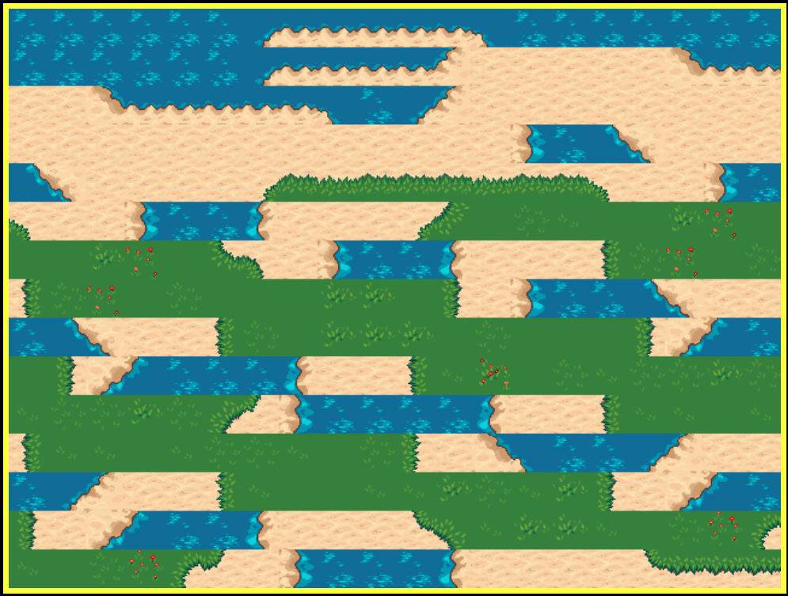

# tiled-kaboom

This is a map-loader for [kaboom](https://kaboomjs.com/) to load [tiled](https://www.mapeditor.org/) JSON maps.




Here is an [example of it running](https://notnullgames.github.io/tiled-kaboom/). Here is [the source](https://github.com/konsumer/tiled-kaboom/blob/main/index.html).

---


The terrain tiles came from [here](https://opengameart.org/content/tiled-terrains) and uses a terrain-set to make it really fast & easy to make cool maps in tiled.

## usage

In your map-files, make sure the compression is turned off. Embed your tilemaps.


The basic usage with Kaboom goes like this:

```js
const k = kaboom({
  plugins: [ tiledKaboom ]
})

// then later

const { sprites, levels, key } = await k.loadTiledMap(YOUR_MAP_OBJECT)
for (let level of levels) {
  k.addLevel(level, { width: 32, height: 32, ...key })
}
```

There are a couple of different ways to get `tiledKaboom` depending on how you are doing things.


### regular tag

If you are not using `type="module"` in your `<script>` tags, and aren't using a bundler, you can do this:

```html
<script src="https://unpkg.com/tiled-kaboom"></script>
```

This will add `tiledKaboom` to your global-scope, so it can be used with `kaboom`.

### npm-based project

If you are using an npm-based project (like with a bundler of some kind) you can do this:

```sh
npm i tiled-kaboom
```

And then use it:


```js
import tiledKaboom from 'tiled-kaboom'
```

or 

```js
const tiledKaboom = require('tiled-kaboom')
```

### browser es6 module

I personally like to use the new ES6 module support in modern browsers. You can do this a couple ways:

```html
<script type="module">
import tiledKaboom from 'https://unpkg.com/tiled-kaboom@latest/dist/kaboom-tiled.modern.js'
</script>
```

You can also use an import-map, if you want it to look neater in your actual code:

```html
<!-- first tell your browser where to find tiled-kaboom -->
<script type="importmap">
{
  "imports": {
    "tiled-kaboom": "https://unpkg.com/tiled-kaboom@latest/dist/kaboom-tiled.modern.js"
  }
}
</script>

<!-- now your imports will look like they do in node -->
<script type="module">
import tiledKaboom from 'tiled-kaboom'
</script>
```


### TODO

- more testing. only basic map is working
- support more modes/orientation
- margin/spacing will probably require more work on kaboom-side
- per-tile collision shapes is nice for things like coastlines
- support for tags ("custom properties")
- support for object-layers (both shapes and images)
- support for animations
- automatic linkage, by name, with objects and sprites
- it might be cool to be able to assign your own symbols to specifc tiles to make maps a little more readable.